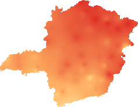
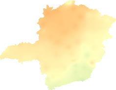

# Development of a Solar Radiation Map Using Artificial Intelligence Techniques

This repository hosts my Python implementation of the paper "Development of a Solar Radiation Map Using Artificial Intelligence Techniques", authored by Rafael Amauri Diniz Augusto, Cristiana Brasil Maia, and Silvio Jamil Ferzoli Guimarães.

The code is entirely authored by me and can be used and redistributed in any way, in accordance with the MIT License.

## Sample Results

  

Predicted Solar Irradiance in Minas Gerais for January and June 2018

The images above show the results obtained for predicting the solar irradiance in January and June of 2018 using 3 years worth of training data, from 2015 to 2017.

The MAE (Median Absolute Error) score for the forecast value for these months was 0.4 and 0.37 kWh/m²/day. Given said months yielded an average irradiance of 6 and 3.3 kWh/m²/day respectively, this translates to an absolute error that represents less than 10% of the predicted irradiance. 

## ⚠️ Disclaimer

The project was entirely developed in Linux, for Linux! While I don't see a reason why it should't work with Windows or Mac, I recommend installing Linux, using a virtual machine or even using the Linux inside your smart fridge. 

Before opening an issue, please make sure to test on Linux beforehand.

## 🛠️  Installation 

Install the latest Python version for the best results!

Use the package manager [pip](https://pip.pypa.io/en/stable/) to install the requirements.

```bash
pip install -r requirements.txt
```

## 🚀 Usage

Use the ```src/main.py``` file to orchestrate what stations to predict the values. The predictor comes with several attributes set with the default values. If you want to change them or explore what other attributes the predictor has, make sure to check the source code in ```src/hwts/predictor.py``` and change it to your will!

The repository comes with a few sample datasets. They can be found in ```src/stations```. Each dataset is independent of the other, so you can forecast values for how many stations you want.

After forecasting values for a number of stations, it's possible to create images such as the ones displayed above by using the free and open-source software [QGIS](https://qgis.org/en/site/).

The predictor supports parallel processing of the weather stations! By default 6 threads are spawned for multiprocessing, but if you wish to change this value, simply edit the file ```main.py```.

## Contributing
Pull requests are welcome. For major changes, please open an issue first to discuss what you would like to change.

Please make sure to update tests as appropriate.

## License
[MIT](https://choosealicense.com/licenses/mit/)
